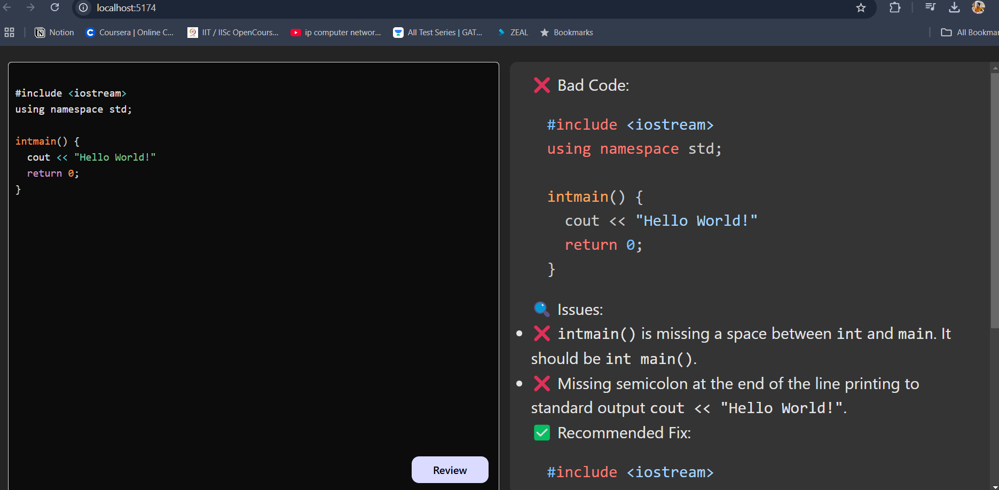

# 🧠 AI-Powered Code Reviewer (MERN + Google Gemini API)
🚀 **Enhance your coding with AI!** This project uses **Google Gemini 2.0 Flash API** to analyze, review, and suggest improvements for JavaScript code.  

  

## ✨ Features  
✅ AI-driven **code analysis** & **bug detection**  
✅ **Auto-fixes & best practice suggestions**  
✅ **Full-stack MERN app** (React + Node.js + MongoDB)  
✅ **Google Gemini 2.0 Flash API** for AI-powered reviews  

---

## 🛠️ Tech Stack  
- **Frontend:** React, TailwindCSS  
- **Backend:** Node.js, Express  
- **Database:** MongoDB  
- **AI Model:** Google Gemini 2.0 Flash API  

---

## 🚀 Installation & Setup  
# Install backend dependencies
cd backend  
npm install  

# Install frontend dependencies
cd ../frontend  
npm install  
### 🔧. Clone the Repository**  

Set Up Google Gemini API Key
Create a .env file inside the backend/ folder and add:

GOOGLE_GEMINI_API_KEY=your_api_key_here
